# Fluxo do sistema Linus

```mermaid
flowchart LR
    A([Acesso ao sistema]) --> B[Landing page]
    B --> C{Possui conta?}
    C -- Não --> D[Cadastro]
    C -- Sim --> E[Login]
    D --> F[Autenticação]
    E --> F
    F --> G[Validação no backend]
    G --> H[Painel do estudante]
    H --> I{Triagem inicial?}
    I -- Sim --> J[Responder triagem]
    I -- Não --> K[Selecionar trilha]
    J --> L[Definir nível]
    L --> K
    K --> M[Selecionar lição]
    M --> N[Executar prática musical]
    N --> O[Registrar progresso]
    O --> P[Acessar glossário]
    P --> Q[Consulta de IA / assistente]
    Q --> R[Visualizar evolução e gamificação]
    R --> S([Fluxo concluído])

    F --> T[(PostgreSQL)]
    G --> T
    O --> T
    P --> T
    R --> T

    classDef user fill:#e3f2fd,stroke:#1e88e5,color:#0d47a1;
    classDef app fill:#e8f5e9,stroke:#43a047,color:#1b5e20;
    classDef data fill:#fff3e0,stroke:#fb8c00,color:#e65100;

    class A,B,C,D,E,F,G,H,I,J,K,L,M,N,O,P,Q,R,S user;
    class T data;
```

Este diagrama representa o fluxo principal do Linus em uma visão horizontal, com autenticação, triagem, aprendizagem, prática musical, acompanhamento de progresso, glossário e integração com assistente de IA.
